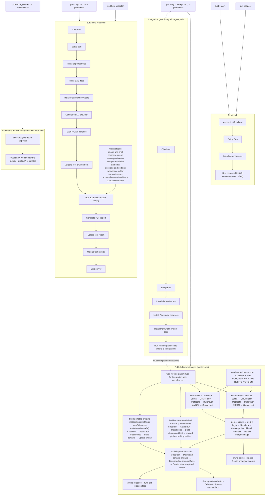

# CI workflows and dependencies

This map documents the current GitHub Actions CI/release flow across all workflow files in `.github/workflows/`.

## Source files

- `.github/workflows/ci.yml`
- `.github/workflows/e2e.yml`
- `.github/workflows/integration-gate.yml`
- `.github/workflows/publish.yml`
- `.github/workflows/workitems-lock.yml`
